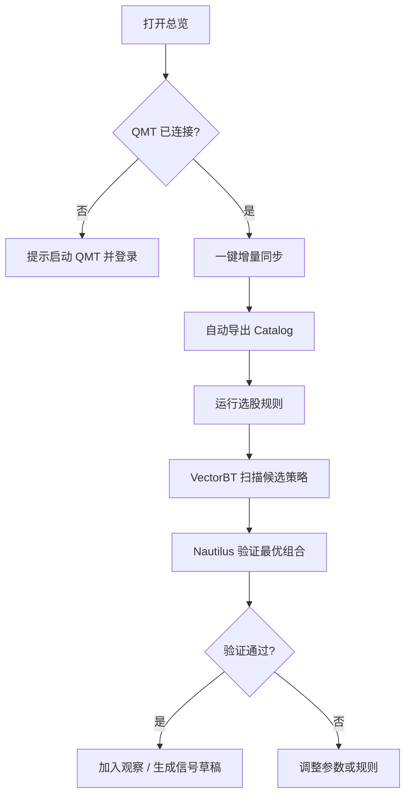

# qmt-quant UI / 交互设计稿

> **版本**：v0.1  
> **日期**：2026-07-26  
> **状态**：草稿  
> **关联**：[需求文档](./需求文档.md) · [交互原型 Canvas](../canvases/qmt-quant-ui-mockup.canvas.tsx)

---

## 1. 设计目标

| 目标 | 说明 |
|------|------|
| 任务导向 | 用户按「同步数据 → 研究 → 验证 → 选股 → 实盘」自然流转，不被技术细节淹没 |
| 双引擎可见 | VectorBT 与 NautilusTrader 在界面层明确分区，避免混用概念 |
| 状态透明 | QMT 连接、数据覆盖率、任务进度、验证偏差一目了然 |
| 安全默示 | 实盘默认 Dry Run，危险操作需二次确认 |
| 桌面优先 | 宽屏三栏/双栏布局，最小宽度 1280px；暂不做移动端 |

---

## 2. 信息架构

```
qmt-quant
├── 总览 Dashboard          [P0] 状态面板 + 快捷入口
├── 数据中心 Data           [P0] 同步、导出、健康检查
├── 研究回测 Research       [P0] VectorBT 参数扫描
├── 验证回测 Validation     [P0] NautilusTrader 高保真验证
├── 选股 Screening          [P1] 规则 + 结果 + 桥接回测
├── 实盘 Live               [P2] 持仓、下单、风控
└── 全局
    ├── 任务中心（后台 Job 队列）
    ├── 设置（QMT 路径、双环境、费率）
    └── 日志/审计
```

### 导航结构

- **左侧固定导航栏**（196px）：6 个主模块 + 底部 QMT 连接状态
- **顶栏**：当前页标题、副标题、全局「任务日志」「设置」
- **主内容区**：随模块变化，统一 24px 内边距

---

## 3. 视觉规范（草稿）

### 3.1 风格定位

专业量化工作台：深色为主、扁平、无装饰性渐变。参考 Cursor / VS Code 信息密度，而非消费级金融 App 的炫目 K 线风格。

### 3.2 色彩语义

| 语义 | 用途 |
|------|------|
| 成功绿 | 同步完成、验证通过、盈利 |
| 警告黄 | 数据缺口、VBT/NT 偏差偏大、Dry Run |
| 危险红 | 实盘模式、下单确认、任务失败 |
| 信息蓝 | VectorBT 研究层、进行中的任务 |
| 中性灰 | 基准对比、次要信息 |

### 3.3 字体与密度

| 层级 | 规格 |
|------|------|
| 页面标题 | 18px semibold |
| 区块标题 | 14px semibold |
| 正文 | 13px |
| 数据/代码 | 12px monospace |
| 表格行高 | 36px |

### 3.4 组件库（实现建议）

| 组件 | 技术选型 |
|------|----------|
| 桌面壳 | **Tauri 2** 或 **PyWebView** 包装本地 Web |
| 前端框架 | **Vue 3** + **Element Plus** 或 **React** + **shadcn/ui** |
| 图表 | **ECharts**（热力图、净值曲线、参数扫描） |
| 表格 | 虚拟滚动大表（选股结果、成交明细） |
| 后台通信 | 本地 API（FastAPI / Tornado）+ WebSocket 推送任务进度 |

---

## 4. 页面设计

### 4.1 总览 Dashboard

**目的**：一屏掌握系统是否可用，并提供最高频操作的捷径。

```
┌──────────┬────────────────────────────────────────────────────┐
│ 导航     │  总览                              [任务日志] [设置] │
│          ├────────────────────────────────────────────────────┤
│ 总览 ●   │  [日线98.6%] [财务4/4] [研究12.8s] [验证3/4]       │
│ 数据中心 │                                                    │
│ 研究回测 │  数据新鲜度 ████████████████████░░ 98.6%           │
│ 验证回测 │                                                    │
│ 选股     │  ┌─快捷操作─────┐  ┌─最近任务──────────────────┐  │
│ 实盘     │  │ 增量同步      │  │ sync bars      完成 11m   │  │
│          │  │ 导出 Catalog  │  │ research sweep 完成 12s   │  │
│          │  │ 双引擎Pipeline│  │ validate       排队       │  │
│          │  └──────────────┘  └───────────────────────────┘  │
│ QMT 已连接│  QMT同步 → Parquet → VBT → NT → 选股 → 实盘      │
└──────────┴────────────────────────────────────────────────────┘
```

**关键交互**：
- 指标卡可点击跳转对应模块
- 「双引擎 Pipeline」打开向导：选策略 → 选区间 → 一键串联 VBT 扫描 + NT 验证
- 最近任务行点击展开日志抽屉

---

### 4.2 数据中心 Data

**目的**：管理 QMT 数据同步与本地存储质量。

**布局**：顶部 3 张操作卡（日线 / 财务 / Catalog）+ 下方健康检查表。

| 区域 | 内容 | 交互 |
|------|------|------|
| 日线同步卡 | 板块、复权、起始日、上次结果 | 「立即增量」→ 进度条 + 实时成功/失败计数 |
| 财务同步卡 | 4 张核心报表状态 | 勾选报表 → 增量同步 |
| Catalog 卡 | 自动导出开关、目录路径 | Toggle 持久化到配置 |
| 健康检查表 | 覆盖率、缺口说明 | 缺口行可点击 → 弹窗列出股票代码 |

**进度反馈**（同步进行中）：
```
正在同步日线…  ████████░░░░  3420/5120  预计剩余 8 分钟
失败 3 只  [查看并重试]
```

**空态处理**：若从未同步，Dashboard 显示醒目引导条「请先完成首次全量同步」，数据中心页主按钮变为「开始首次同步」。

---

### 4.3 研究回测 Research（VectorBT）

**目的**：快速参数扫描，输出候选策略组合。

**布局**：左配置面板（固定 320px）+ 右结果区（热力图 + 指标 + 操作栏）。

| 配置项 | 控件 |
|--------|------|
| 策略 | 下拉 + 参数动态表单 |
| 标的池 | 文件选择 / 板块 / 选股结果 |
| 区间 | 日期范围选择器 |
| 扫描维度 | 多值输入（如 `5,10,20`） |
| 费率 | 折叠高级设置 |

**结果区**：
1. **参数热力图**（ECharts）：X=短均线，Y=长均线，色深=收益
2. **Top 5 组合表**：收益、夏普、回撤、过拟合风险提示
3. **操作**：「发送到验证」将最优参数预填到 Validation 页

**交互细节**：
- 扫描运行中：右侧显示骨架屏 + 已完成的组合数
- 点击热力图格子 → 高亮该参数组合并更新右侧指标
- 扫描完成后自动保存到 `reports/research_*.json`

---

### 4.4 验证回测 Validation（NautilusTrader）

**目的**：对研究层候选策略做高保真验证，并与 VBT 结果对比。

**布局**：左验证配置 + 右净值对比图 + 下方成交表。

| 元素 | 说明 |
|------|------|
| 来源标签 | 「来自研究层」显示推送的参数 |
| Venue 规则 | T+1、整手、费率只读展示，可展开编辑 |
| 净值对比图 | 三条线：NT 策略 / VBT 研究 / 基准 |
| 偏差指标 | VBT vs NT 收益差，>10% 显示警告 |
| 验证结论 | 通过 / 需复核 / 不通过 |

**关键交互**：
- 「运行验证」前检查 Parquet Catalog 是否就绪，否则阻断并引导去数据中心
- 验证完成后可「加入观察列表」或「生成实盘信号草稿（P2）」

---

### 4.5 选股 Screening

**目的**：全市场横截面筛选，结果接入双引擎。

**布局**：左规则编辑（YAML 可视化 + 代码切换）+ 右结果表。

| 模式 | 说明 |
|------|------|
| 可视化模式 | 条件行：字段 + 运算符 + 值，拖拽排序 |
| 代码模式 | YAML 编辑器，语法高亮 |
| 结果表 | 可排序、可导出 CSV、可选中子集 |

**底部操作栏**：
- `VectorBT 回测选股池`
- `Nautilus 验证选股池`
- `因子 IC 分析` → 弹出 IC 时序图

**选股 → 回测桥接流程**：
```
选股完成 → 选择回测引擎 → 确认区间与调仓频率 → 跳转对应页面（参数已预填）
```

---

### 4.6 实盘 Live（P2）

**目的**：xttrader 下单与持仓管理，默认安全。

| 安全设计 | 说明 |
|----------|------|
| Dry Run 默认开启 | 顶部 Toggle，关闭需弹窗二次确认 |
| 实盘模式横幅 | 红色顶栏「实盘模式已启用」 |
| 下单确认 | 每笔订单预览：代码、方向、数量、预估金额 |
| 风控阻断 | 超仓位/ST/涨跌停时按钮禁用并说明原因 |

**布局**：状态条 + 4 指标卡 + 持仓表 + 委托/成交 Tab。

---

## 5. 核心用户流程

### 5.1 每日收盘后标准流程



### 5.2 新策略从零验证

1. **数据中心** → 确认数据覆盖回测区间  
2. **研究回测** → 选策略 + 参数扫描 → 记录最优组合  
3. **验证回测** → 接收参数 → 运行 → 对比 VBT 曲线  
4. **选股**（若基本面策略）→ 确认因子无未来函数  
5. **实盘**（P2）→ Dry Run 跑一周 → 再考虑 `--live`

### 5.3 任务与通知

| 事件 | 反馈方式 |
|------|----------|
| 同步开始/进度 | 顶栏任务图标旋转 + 页内进度条 |
| 同步完成 | Toast + 总览指标刷新 |
| 回测完成 | 浏览器通知（可选）+ 结果页自动展开 |
| 验证偏差过大 | 黄色 Callout + 建议复核文案 |
| QMT 断连 | 侧边栏状态变红 + 全局 Banner |

---

## 6. 全局组件

### 6.1 任务中心（抽屉）

从顶栏「任务日志」打开右侧抽屉：

| 列 | 说明 |
|----|------|
| 任务名 | sync / research / validate / screen |
| 状态 | 排队 / 运行中 / 完成 / 失败 |
| 进度 | 百分比或耗时 |
| 操作 | 查看日志 / 取消 / 重试 |

### 6.2 设置页

| 分组 | 配置项 |
|------|--------|
| QMT | 安装路径、userdata、账号 |
| 环境 | qmt-env / quant-env Python 路径 |
| 数据 | DB 路径、Catalog 目录、默认复权 |
| 回测 | 初始资金、佣金、滑点、最大仓位 |
| 安全 | Dry Run 默认、实盘确认方式 |

### 6.3 命令面板（Phase 2+）

`Ctrl+K` 唤起，支持：
- `sync bars incremental`
- `research run ma_cross`
- `validate run --from-research`
- `screen run low_pe_momentum`

---

## 7. 技术实现分期

| 阶段 | UI 交付 |
|------|---------|
| Phase 1 | CLI only + 简单 Web 数据状态页 |
| Phase 2 | 研究/验证页 MVP（表单 + 图表 + 任务轮询） |
| Phase 3 | 选股页 + Dashboard 总览 |
| Phase 4 | Tauri 桌面壳 + 任务中心抽屉 |
| Phase 5 | 实盘页 + 安全确认流 |

**一期最小 Web MVP**（建议先做）：
- 单页应用 4 个路由：Dashboard / Data / Research / Validation
- FastAPI 后端暴露 sync、backtest job API
- WebSocket 推送任务进度

---

## 8. 线框图索引

可交互原型见仓库内 Canvas 文件：

**[canvases/qmt-quant-ui-mockup.canvas.tsx](../canvases/qmt-quant-ui-mockup.canvas.tsx)**

| 页面 | Canvas 中可体验 |
|------|----------------|
| 总览 | 指标卡、快捷操作、最近任务、工作流条 |
| 数据中心 | 三卡操作区、健康检查表、自动导出 Toggle |
| 研究回测 | 策略配置、参数扫描图、发送到验证 |
| 验证回测 | NT 配置、三曲线对比、成交明细 |
| 选股 | YAML 规则、结果表、桥接按钮 |
| 实盘 | Dry Run Toggle、持仓表、安全提示 |

---

## 9. 待确认

| 项 | 选项 | 建议 |
|----|------|------|
| 桌面壳 | Tauri / PyWebView / 纯浏览器 | Tauri（原生感 + 系统托盘） |
| 前端框架 | Vue 3 / React | 与团队熟悉度一致即可 |
| 一期是否做 Web | 是 / 仅 CLI | Phase 2 起做 Web MVP |
| 图表库 | ECharts / Plotly | ECharts（热力图成熟） |

---

**变更记录**

| 版本 | 日期 | 变更 |
|------|------|------|
| v0.1 | 2026-07-26 | 初稿：IA、6 页面线框、交互流程、Canvas 原型 |
